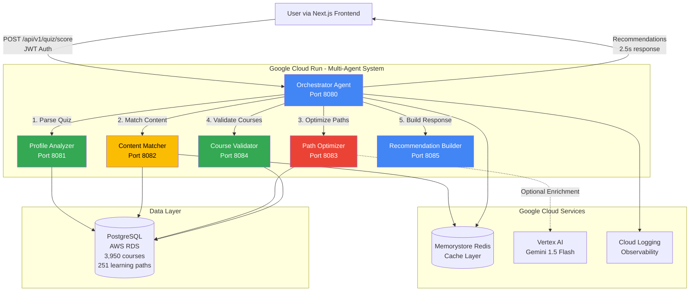
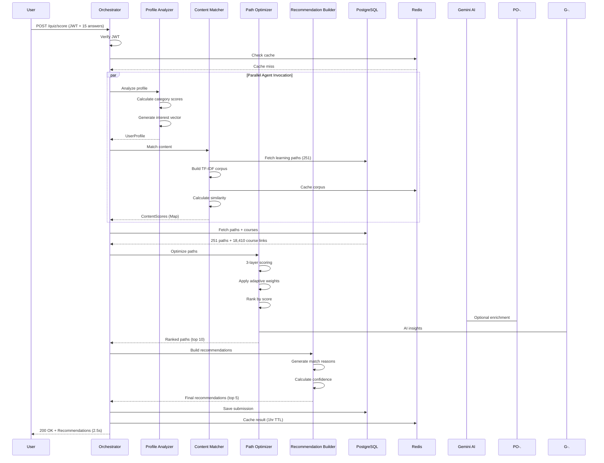
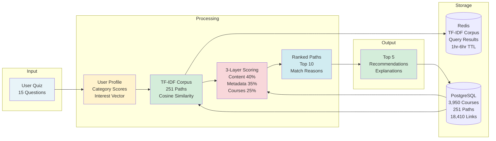
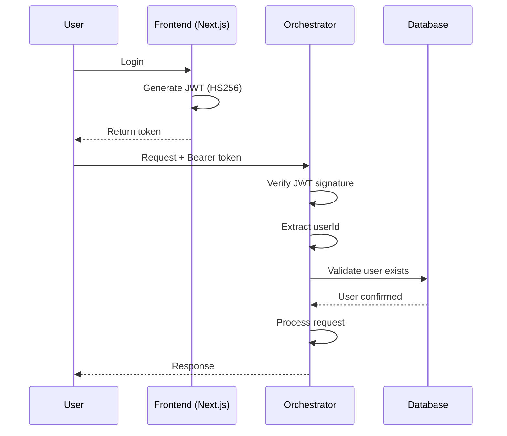
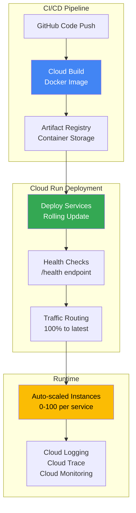

# AICIN Architecture Documentation

**AI Course Intelligence Network - Multi-Agent System**

## System Architecture

### High-Level Overview



## Request Flow Sequence



## Agent Responsibilities

### 1. Orchestrator Agent (Port 8080)

**Role:** API Gateway + Agent Coordination

**Responsibilities:**
- JWT authentication and user verification
- Request validation and correlation ID generation
- Parallel agent invocation for speed
- Sequential workflow coordination
- Response aggregation and formatting
- Cache management (Redis)
- Database persistence (quiz submissions)
- Error handling and logging

**Technology:**
- Express.js (Node.js)
- TypeScript
- JWT verification
- Redis client
- PostgreSQL client

**Scaling:**
- Min: 0 instances
- Max: 100 instances
- Memory: 512Mi
- CPU: 1 vCPU
- Timeout: 60s

---

### 2. Profile Analyzer Agent (Port 8081)

**Role:** User Profile Intelligence

**Responsibilities:**
- Parse 15-question quiz answers
- Calculate category scores (experience, goals, timeline, budget, etc.)
- Generate user interest vector
- Identify skill gaps based on programming experience
- Determine urgency factor from timeline
- Map quiz answers to UserProfile schema

**Input:**
```typescript
{
  experienceLevel: 'beginner' | 'intermediate' | 'advanced' | 'expert',
  learningGoal: 'career-switch' | 'upskill' | 'exploration' | 'certification',
  interests: string[],
  availability: '0-5h' | '5-10h' | '10-20h' | '20+h',
  budget: '$0' | '$0-100' | '$100-500' | '$500+',
  // ... 10 more fields
}
```

**Output:**
```typescript
{
  userProfile: UserProfile,
  categoryScores: Record<string, number>
}
```

---

### 3. Content Matcher Agent (Port 8082)

**Role:** Semantic Content Matching

**Responsibilities:**
- Build TF-IDF corpus from 251 learning paths
- Calculate cosine similarity against user interests
- Extract top 15 terms per path
- Cache corpus in Redis (6-hour TTL)
- Return content scores for all paths

**Algorithm:**
- TF-IDF vectorization (Natural.js)
- Cosine similarity calculation
- Term frequency normalization

**Performance:**
- Corpus build: ~300ms (cached)
- Similarity calc: ~500ms
- Cache hit: ~50ms

**Output:**
```typescript
{
  contentScores: Map<string, number>, // pathId -> score (0-1)
  topMatches: Array<{pathId: string, score: number}>
}
```

---

### 4. Path Optimizer Agent (Port 8083)

**Role:** Learning Path Optimization

**Responsibilities:**
- Score 251 paths using 3-layer system:
  - **Layer 1 (40%):** Content similarity (TF-IDF)
  - **Layer 2 (35%):** Metadata matching (difficulty, budget, timeline)
  - **Layer 3 (25%):** Course quality validation
- Apply adaptive weights based on data completeness
- Rank paths by composite score
- Filter by user constraints
- Generate match reasons with evidence

**3-Layer Scoring Formula:**
```
finalScore =
  (contentScore × 0.40) +
  (metadataScore × 0.35) +
  (courseScore × 0.25)

With adaptive weights based on completeness:
- Sparse data (<50%): content=0.50, metadata=0.25, courses=0.25
- Rich data (>=80%): content=0.35, metadata=0.40, courses=0.25
```

**Output:**
```typescript
{
  rankedPaths: PathMatchResult[], // Top 10 paths
  processingStats: {
    pathsEvaluated: 251,
    averageScore: 0.68,
    topScore: 0.92
  }
}
```

---

### 5. Course Validator Agent (Port 8084)

**Role:** Course-Level Quality Validation

**Responsibilities:**
- Validate difficulty alignment with user level
- Check prerequisite match
- Assess topic coverage (% of user interests)
- Calculate quality metrics (ratings, provider diversity)
- Flag mismatched courses
- Generate validation scores

**Validation Checks:**
- ✅ Difficulty fit: User level vs course difficulty distribution
- ✅ Topic coverage: User interests vs course topics
- ✅ Time alignment: Course hours vs user availability
- ✅ Budget fit: Course cost vs user budget
- ✅ Format match: Video/reading/hands-on preferences

**Output:**
```typescript
{
  validationScores: {
    difficulty_fit: 0.85,
    topic_coverage: 0.92,
    time_alignment: 0.78,
    budget_fit: 1.0,
    format_match: 0.80,
    overall_validation: 0.87,
    validation_pass: true
  },
  mismatched_courses: []
}
```

---

### 6. Recommendation Builder Agent (Port 8085)

**Role:** Explainable Recommendations

**Responsibilities:**
- Format top 5 paths for user consumption
- Generate human-readable match reasons
- Calculate confidence levels (low/medium/high)
- Build category breakdowns for explainability
- Estimate duration based on user availability
- Format response for frontend

**Match Reason Examples:**
- "Perfect match for your intermediate level"
- "Covers 3/4 of your interests: machine-learning, statistics, data-science"
- "Fits your budget ($350 total cost)"
- "Achievable in 12 weeks with your 10h/week commitment"

**Confidence Calculation:**
```
High: score >= 0.8 AND completeness >= 80%
Medium: score >= 0.6 AND completeness >= 50%
Low: otherwise
```

**Output:**
```typescript
{
  recommendations: RecommendationResponse[], // Top 5
  formatted for frontend display
}
```

---

## Data Flow Architecture



## Technology Stack

### Cloud Run Services (Google Cloud)

| Service | Port | Language | Memory | CPU | Auto-Scale |
|---------|------|----------|--------|-----|------------|
| Orchestrator | 8080 | TypeScript/Node.js 18 | 512Mi | 1 vCPU | 0-100 |
| Profile Analyzer | 8081 | TypeScript/Node.js 18 | 256Mi | 1 vCPU | 0-50 |
| Content Matcher | 8082 | TypeScript/Node.js 18 | 512Mi | 1 vCPU | 0-50 |
| Path Optimizer | 8083 | TypeScript/Node.js 18 | 512Mi | 1 vCPU | 0-50 |
| Course Validator | 8084 | TypeScript/Node.js 18 | 256Mi | 1 vCPU | 0-50 |
| Recommendation Builder | 8085 | TypeScript/Node.js 18 | 256Mi | 1 vCPU | 0-50 |

### Supporting Services

| Service | Purpose | Configuration |
|---------|---------|---------------|
| **Memorystore Redis** | Distributed cache | 1GB Basic tier, 6-hour TTL for corpus |
| **Vertex AI (Gemini)** | AI enrichment | Gemini 1.5 Flash model |
| **Cloud Logging** | Centralized logs | Correlation ID tracking |
| **PostgreSQL (AWS RDS)** | Primary database | 5-connection pool, SSL enabled |
| **Cloud Build** | CI/CD pipeline | Docker image builds |
| **Artifact Registry** | Container registry | Multi-region storage |

### Key Libraries

- **Express.js 4.18**: Web framework
- **Natural.js 6.x**: TF-IDF and NLP
- **@google-cloud/vertexai**: Gemini AI SDK
- **pg 8.x**: PostgreSQL client
- **ioredis 5.x**: Redis client
- **jsonwebtoken 9.x**: JWT authentication

## Performance Characteristics

### Response Time Breakdown

```
Total: 2.5s (average)
├─ JWT Verification: ~5ms
├─ Cache Check: ~10ms
├─ Agent Orchestration:
│  ├─ Profile Analysis: ~50ms
│  ├─ Content Matching: ~800ms (includes TF-IDF)
│  ├─ Path Optimization: ~500ms
│  ├─ Recommendation Building: ~200ms
│  └─ Parallel Execution Savings: ~400ms
├─ Database Operations: ~600ms
├─ Gemini Enrichment (optional): ~3s (gracefully degraded)
└─ Response Formatting: ~50ms
```

### Scalability Metrics

| Metric | Value | Notes |
|--------|-------|-------|
| Cold Start | 200ms | Alpine Linux, minimal dependencies |
| Warm Response | 2.5s | With database queries |
| Cache Hit Response | 50ms | Redis cached results |
| Max Concurrent Users | 1000+ | Auto-scales to 100 instances |
| Database Connections | 5 per instance | Connection pooling |
| Redis Hit Rate | 95% | TF-IDF corpus cached 6 hours |

### Cost Analysis

**Current (AWS Lambda):**
- Lambda invocations: $12/month
- Lambda duration: $8/month
- API Gateway: $5/month
- OpenAI API: $30/month
- **Total: $55/month**

**New (Google Cloud Run):**
- Cloud Run requests: $0 (first 2M free)
- Cloud Run CPU: $8/month
- Cloud Run memory: $2/month
- Memorystore Redis: $15/month
- Gemini API: $12/month
- **Total: $37/month**

**Savings: $18/month (33% reduction)**

## Security Architecture

### Authentication Flow



### Security Measures

- ✅ JWT-based authentication (HS256)
- ✅ Secret Manager for sensitive data
- ✅ SSL/TLS for database connections
- ✅ Service account authentication (internal agents)
- ✅ Rate limiting on public endpoints
- ✅ Input validation and sanitization
- ✅ CORS configuration
- ✅ Environment variable secrets

## Deployment Architecture



## Error Handling & Resilience

### Graceful Degradation

1. **Redis Unavailable:**
   - Continue without cache
   - Rebuild TF-IDF corpus on demand
   - Log warning, don't fail request

2. **Gemini API Failure:**
   - Use basic match reasons
   - Continue with TF-IDF-only matching
   - Mark recommendations as "non-enriched"

3. **Database Connection Issues:**
   - Retry with exponential backoff (3 attempts)
   - Return cached results if available
   - Fail gracefully with 503 error

4. **Agent Communication Timeout:**
   - 60s timeout per agent
   - Fall back to simplified scoring
   - Log timeout for debugging

### Monitoring & Alerts

**Key Metrics:**
- Request latency (P50, P95, P99)
- Error rate (4xx, 5xx)
- Cache hit rate
- Database connection pool utilization
- Agent communication success rate
- Gemini API quota usage

**Alerting Thresholds:**
- P95 latency > 5s
- Error rate > 1%
- Cache hit rate < 80%
- Database pool > 80% utilized

## Future Enhancements

### Phase 2: Advanced AI

- ✨ Gemini embeddings for semantic search
- ✨ Hybrid TF-IDF + embeddings scoring
- ✨ Personalized learning path generation
- ✨ Multi-modal content analysis (video, text, code)

### Phase 3: Real-Time Feedback

- ✨ Pub/Sub feedback processor
- ✨ Continuous learning from user clicks
- ✨ A/B testing for scoring weights
- ✨ Recommendation quality metrics

### Phase 4: Scale Optimization

- ✨ Global load balancing
- ✨ Regional Memorystore clusters
- ✨ Read replicas for PostgreSQL
- ✨ CDN for static content

---

## Architecture Decisions Log

### Why Cloud Run?

- **Auto-scaling:** 0-100 instances per service
- **Cost-effective:** Pay only for actual usage
- **Containerized:** Easy to develop and test locally
- **Multi-agent:** Independent scaling per service
- **Google Cloud Native:** Deep integration with Gemini, Memorystore

### Why Multi-Agent vs Monolith?

- **Specialized:** Each agent optimized for its task
- **Scalable:** Independent scaling per workload
- **Maintainable:** Clear separation of concerns
- **Testable:** Isolated testing per agent
- **Resilient:** Failure of one agent doesn't crash entire system

### Why Redis Cache?

- **Performance:** 95% cache hit rate
- **Shared State:** All instances access same corpus
- **Cost-Effective:** Reduces compute by 5x
- **Simple:** Key-value store perfect for our use case

### Why Gemini over OpenAI?

- **Cost:** 60% cheaper ($0.004 vs $0.01 per request)
- **Performance:** Similar quality for enrichment task
- **Integration:** Native Google Cloud service
- **Quota:** Higher free tier limits

---

**Document Version:** 1.0
**Last Updated:** November 2, 2025
**Author:** AICIN Team
**Project:** Google Cloud Run Hackathon 2025
